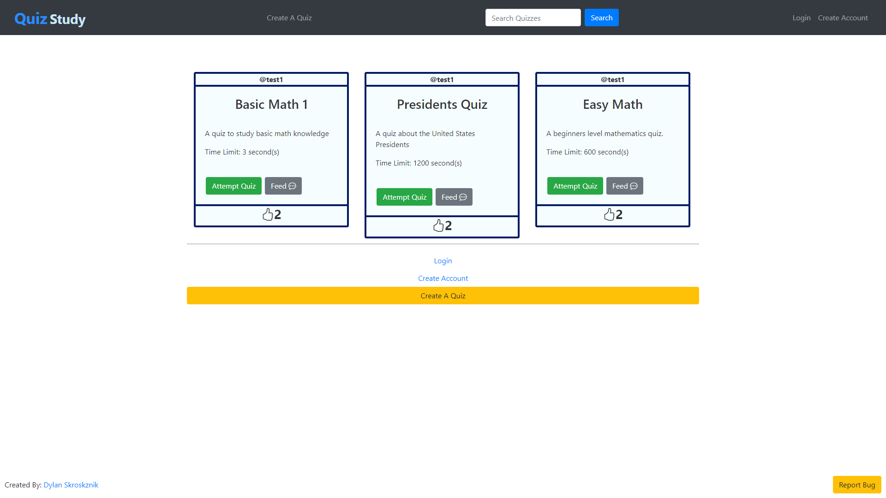
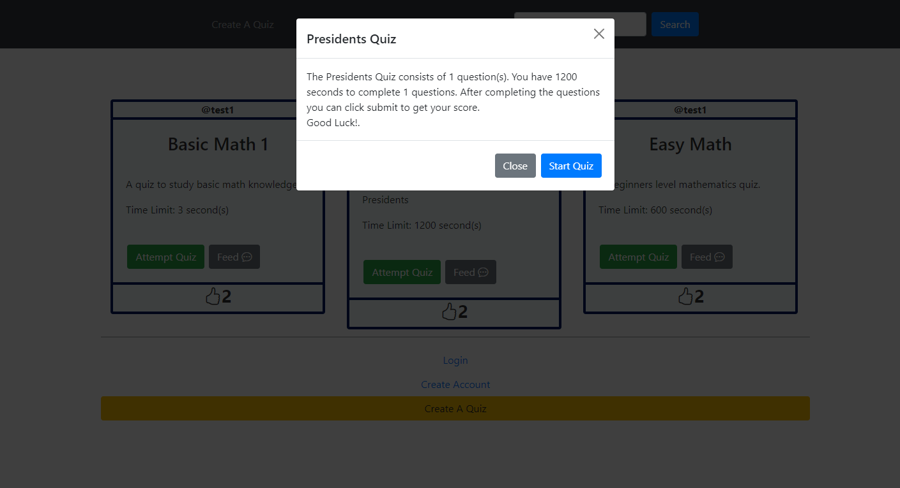
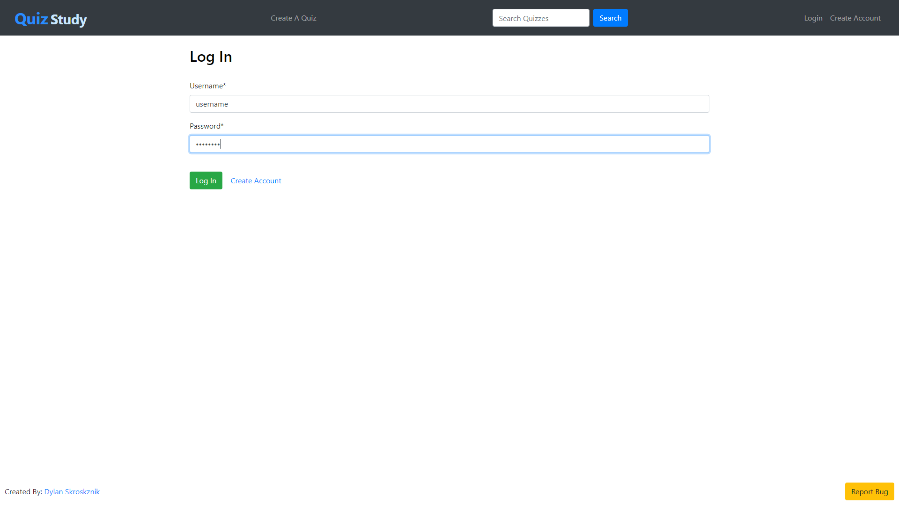
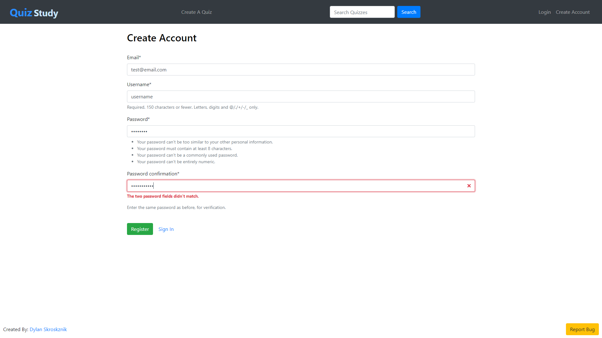
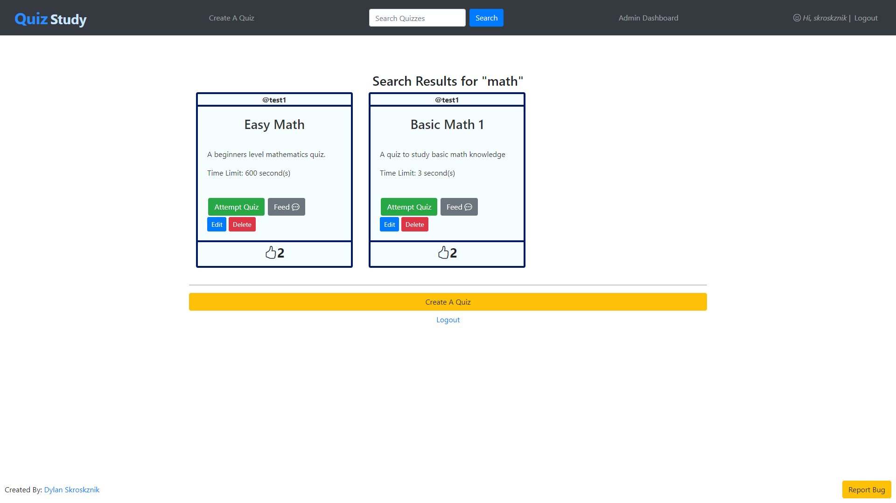
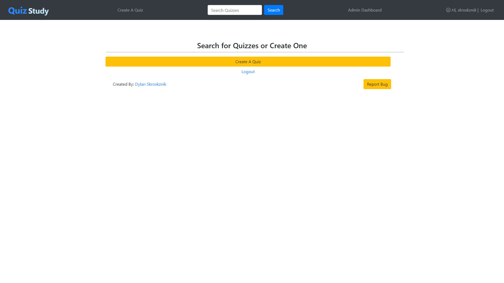
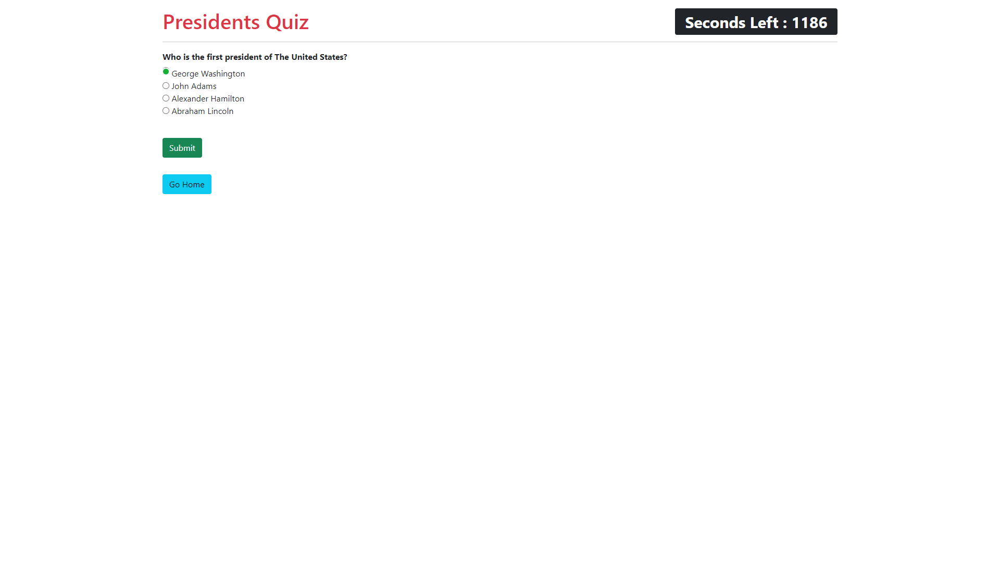
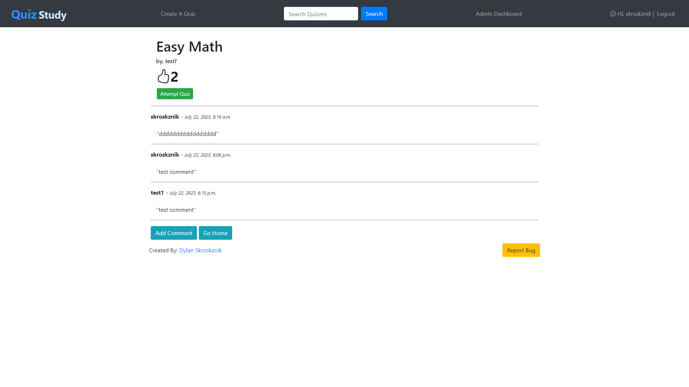

# Quiz-Study-WebApplication 
### QuizStudy helps in building quizzes to improve study habits while being shareable with everyone.
---
## Overview
```py
Welcome to the QuizStudy website! Uncover and key into various quiz topics to challenge your
 knowledge with, or develop and edit your quizzes on whatever topic you desire.
Please encourage others to test their knowledge on these quizzes by sharing
 and commenting on quizzes about your experience which benefits the creators and multiple other users taking quizzes.
The purpose of QuizStudy is to offer an engaging and interactive platform for
 learning while improving self-assessment.
Whether you are a student preparing for exams, a teacher looking for
 creative ways to test your students, or simply a curious mind wanting to expand your knowledge.
QuizStudy offers a user-friendly environment to quickly suit your academic needs.
This web application constitutes a simplified and sufficient registration system
 for individual users to develop their quizzes and share feedback with other quizzes on their terms.
 furthermore, the web app continuously encourages to treat users with respect
 and maintain cyber etiquette towards others on the website.
The objective of this project is to apply accessibility through a safe
 authentication system, demonstrate CRUD program structures, and display
 user-to-data interaction through returns and retrievals.
```

## Contents
- [Welcome To QuizStudy](#welcome-to-quizstudy)
- [Documentations](#documentations)
- [Features](#features)
- [Screenshots](#screenshots)
- [License](#license)

## Welcome To QuizStudy 
*WEBSITE LINK IS DOWN CURRENTLY FOR VERSION TESTING*

1. **Navigate The QuizStudy Link**

   Navigate to the repository details on the right-hand side to locate the website link available.
   

2. **Copy This And Paste To Go**

   Here is the URL link to the QuizStudy app in case of an alternative to accessing the website.


3. **How To Start Taking Quizzes**
   On first view of the website, the steps to first taking quizzes are:
    - Navigate to a quiz of interest and select to take the quiz.
    - *Skip the step if logged in already* - Log in or Register to enable the website to track who is doing the quizzes.
    - Wait to be transported to the quiz and begin to start.
       
   *Quizzes appear on the front page based on a couple of factors:*
    -  Quizzes appearing based on the most recently created at the time.
    -  Utilizing the search bar, the quizzes filtered through from the search term will appear.

4. **How To Start Making Quizzes** 
    - Navigate to "Create Quiz" atop the website header to continue with creating a quiz.
    - *Skip the step if logged in already* - Log in or Register to enable the website to track who creates quizzes.
    - The main information about the quiz time and topics will be available for input then.
    - Next, the editing of questions and their answers for the quiz takes place until satisfied. 

## Documentations
You can navigate these libraries/documentation for resources and guidance on technologies I used when building this website.
  - Django: [learn.microsoft.com/dotnet](https://learn.microsoft.com/en-us/dotnet/)
  - JavaScript: [devdocs.io/javascript](https://devdocs.io/javascript/)
  - jQuery: [w3schools.com/jQuery_intro.asp](https://www.w3schools.com/jquery/jquery_intro.asp)
  - PostgreSQL: [postgresql.org/docs/16](https://www.postgresql.org/docs/16/index.html)

## Features
1. **Account Registering & Log In System**
   - Users can create and manage their quizzes, ensuring the user's information and their quizzes are saved.
   - Ensures users' data and quiz results are secured and accessible only to them.
   - Admin users manage content and user activities, ensuring a well-maintained and orderly platform.
2. **Dashboard Header Tabs (incl. Admin Tab)**
   - Easily accessible to various addresses of QuizStudy, such as Registration, Create Quiz, and Profile Page, simplifying the experience.
   - An Admin Tab, for admin logged-on, allows for managing users, users' details, monitoring quiz submissions, and ensuring the quality of data for platform integrity.
   - Enables users to navigate to desired features and functions, with many ways of enhancing productivity.
3. **Search Bar for Quizzes**
   - Allows users to quickly find specific quizzes by entering keywords to filter by title.
   - Improves the usability of the platform and locates relevant study materials by providing a direct way to access quizzes.
4. **Active Timers with Calculated Results**
   - Helps users develop better time management skills under pressure by how long they take to complete quizzes.
   - Shows immediate testing performances, helping users identify areas for improvement.
5. **Individual Quiz Feedback & Comments**
   - Potential to help improve the quality and accuracy of their quizzes by receiving feedback from users.
   - Encourages ongoing interactions and discussions on quiz topics, helping evolve the learning aspect of the platform.

## Screenshots 
### Main Home Page View



### Log In & Registration Form View



### Home Navigator with Admin Tab & Account Logout 


### Search View For Quiz Filtering



### Quiz Active View


### Quiz Feedback Comments Button


## License
This project is licensed under the Standard Apache License - see the [LICENSE.md](LICENSE.md) file for details.

